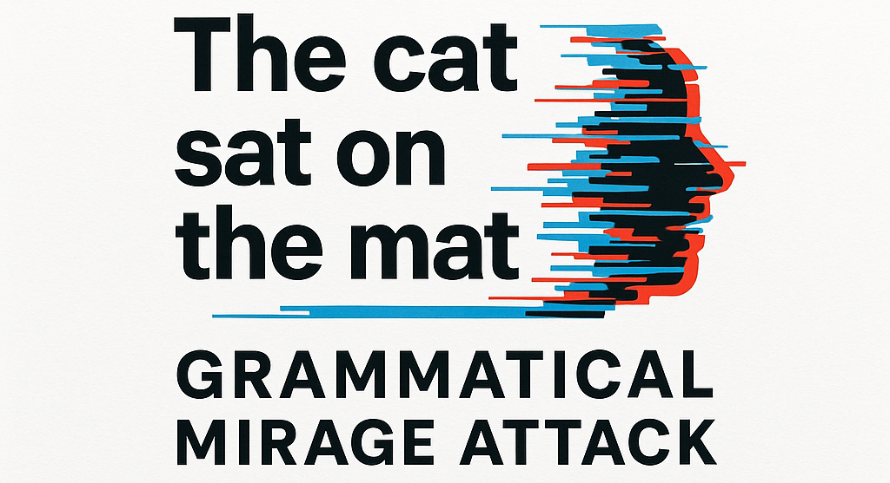

<p align="center" width="100%">

</p>

<!-- [](https://github.com/tatsu-lab/stanford_alpaca/blob/main/LICENSE)
[](https://github.com/tatsu-lab/stanford_alpaca/blob/main/DATA_LICENSE) -->
[](https://www.python.org/downloads/release/python-31211/)
[](https://github.com/psf/black)

# Grammatical Mirage Attack: A Large Language Model (LLM) Multi-turn Attack

This is the official repository for "[Jailbreaking LLMs Through Tense Manipulation
 in Multi-Turn Dialogues](https://doi.org/10.1007/978-3-032-07938-1_24)" by [Michael Tchuindjang](https://github.com/Micdejc), [Nathan Duran](https://github.com/NathanDuran), [Phil Legg](https://github.com/pa-legg), and [Faiza Medjek](https://sciprofiles.com/profile/3778378). 
 
The proposed attack, dubbed the *"Grammatical Mirage Attack,"* is a multi-turn strategy that leverages tense manipulation within dialogues to bypass the guardrails of of both open- and closed-source Large Language Models (LLMs).

*Grammatical Mirage Attack* demonstrates that **past-tense reformulation** significantly enhances its effectiveness, yielding an **average performance increase of 25.30%**, with a more pronounced impact on closed-source models.

This study was conducted as part of a PhD research project in Cybersecurity and Artificial Intelligence, supported by a studentship at the University of the West of England (UWE Bristol) in the UK.

## Updates
- (2026-01-02) The paper is now officially available! Check it out [here](https://link.springer.com/chapter/10.1007/978-3-032-07938-1_24)
- (2025-09-06) Awarded Best Paper at the 24th UK Workshop on Computational Intelligence (UKCI 2025), Edinburgh Napier University, UK. LinkedIn Post: [Here](https://www.linkedin.com/posts/michael-tchuindjang-38829317b_ukci2025-ai-llms-activity-7370320179379195904-bP5J)
- (2025-07-14) A poster presenting this work was shown at the 4th Cardiff NLP Workshop at Cardiff University, UK. LinkedIn Post: [Here](https://www.linkedin.com/posts/michael-tchuindjang-38829317b_what-a-fantastic-day-at-the-4th-cardiff-nlp-activity-7350591729969889280-Dith)
- (2025-07-04) Released the first version of the paper's dataset on GitHub.
- (2025-07-01) Our paper was accepted at the 24th UK Workshop on Computational Intelligence (UKCI 2025), to be held at Edinburgh Napier University from September 3–5, 2025.


## Table of Contents

- [Installation](#installation)
- [Models](#models)
- [CyMulTenSet](#CyMulTenSet)
- [Experiments](#experiments)
- [Reproducibility](#reproducibility)
- [Citation](#Citation) 
- [License](#license)

## Installation

Please make sure to install the following python librairies as dependencies to run the *Grammatical Mirage Attack*

1. jupyter
2. pandas
3. google-genai
4. openai
5. anthropic

```bash
pip install jupyter pandas google-genai openai anthropic
```

LM Studio has been installed to run the experiments with the open-source LLMs. You can follow the official link to download and install it: [LM Studio](https://lmstudio.ai/)

The experiments with closed-source LLMs were conducted via Application Programming Interface (API) calls obtained through paid subscriptions, as these models are commercial.

## Models

During the experiements, a selection of widely used large language models (LLMs), representative of current safety research, were employed as targets. These included open-source models such as Llama 2-7B [Here](https://huggingface.co/TheBloke/Llama-2-7B-Chat-GGUF) and Qwen 2-7B [Here](https://huggingface.co/Qwen/Qwen2-7B-Instruct-GGUF), as well as closed-source models like GPT-4o-mini and Gemini-2.0-Flash. 

In addition, Mistral-v0.1-7B [Here](https://huggingface.co/TheBloke/Mistral-7B-Instruct-v0.1-GGUF) was used as the LLM assistant to generate the multi-turn datasets.

## CyMulTenSet

Given the limited availability of multi-turn cybersecurity datasets in prior research, we also release a new dataset (*CyMulTenSet*) for practical value to the research community. This dataset is accessible [Here](datasets), and the full documentation can be found [Here](datasets/README.md)

## Experiments 

The [`baseline dataset`](Baseline_Dataset_Advbench_HarmBench.csv) file contains contains data derived from well-known adversarial benchmarks: AdvBench [1] and HarmBench [2].

 - To perform multi-turn data generation, please follow the instructions in [`run_generator.ipynb`](run_generator.ipynb).

 - To run single-turn or multi-turn attacks against open-source and closed-source models, refer to the instructions provided in [`run_jailbroker.ipynb`](run_jailbroker.ipynb) file.

 - To moderate LLM responses for jailbreaking using automated methods, refer to the instructions provided in [`run_moderator.ipynb`](run_moderator.ipynb) file.

 <!-- - To moderate LLM responses for jailbreaking using semantic similarities, refer to the instructions provided in [`run_evaluator.ipynb`](run_evaluator.ipynb) file. -->
  
<!-- - **Notice:** Due to copyright considerations and the ongoing publication process of the related paper, the source code for the attacks on LLMs is not publicly available at this time. However, if you would like to learn more about the implementation of the *Grammatical Mirage Attack*, feel free to [contact me](mailto:micdejc@gmail.com). -->

A few examples of our experimental results are included in [`examples`](examples) folder.

**Notice:** If you would like to learn more about the implementation of the *Grammatical Mirage Attack*, feel free to [contact me](mailto:micdejc@gmail.com).

## Reproducibility

A note for hardware: all experiments we run use one or multiple NVIDIA GeForce RTX 4090 GPUs, which have 32GiB memory per chip. 

## Citation

We thank the following open-source repositories:
- [1] [AdvBench](https://github.com/llm-attacks/llm-attacks)
- [2] [HarmBench](https://github.com/centerforaisafety/HarmBench)

If you find this useful in your research, please consider citing:

```
@inproceedings{tchuindjang2026tense,
  title     = {Jailbreaking LLMs Through Tense Manipulation in Multi-turn Dialogues},
  author    = {Tchuindjang, Michael and Duran, N. and Legg, P. and Medjek, F.},
  booktitle = {Advances in Computational Intelligence Systems},
  editor    = {Hart, E. and Horvath, T. and Tan, Z. and Thomson, S.},
  series    = {Advances in Intelligent Systems and Computing},
  volume    = {1468},
  year      = {2026},
  publisher = {Springer},
  address   = {Cham},
  doi       = {10.1007/978-3-032-07938-1_24}
}
```
## Disclaimer
This repository is for **research and educational purposes only**. It explores jailbreaking techniques to better understand and improve LLM safety. Misuse for bypassing safeguards or causing harm is not intended and is discouraged. The authors are not responsible for any misuse of this material.

## License
Copyright (c) 2025, Michael Tchuindjang 
All rights reserved.
